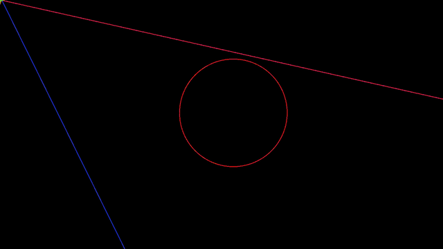
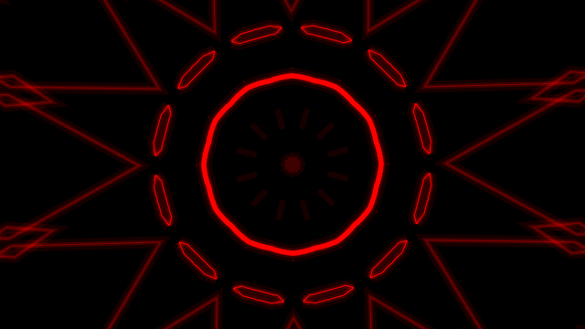
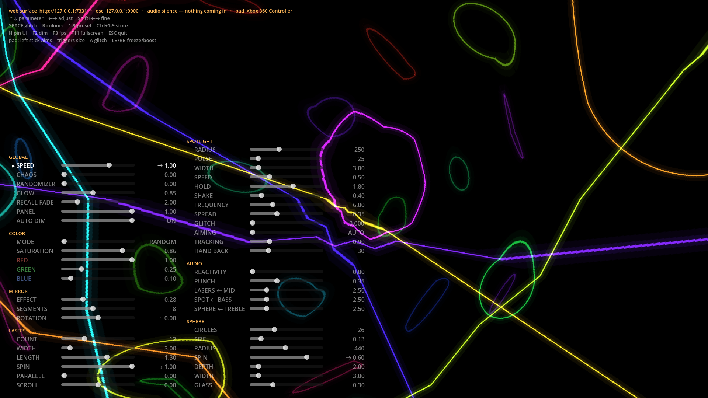

# Déferlante

VJ visuals in Godot 4: neon strokes on black, additively blended.
Built for video projection with a haze machine.

*Déferlante* is French for the breaking wave — the one that surges in and takes the
room. Pull the word apart in English and something else surfaces: **defer**, and a
*lante* one syllable short of *lantern*. A light that keeps putting off the moment
it finds you.

Which is exactly what the spotlight does here. It sweeps, it stops, it trembles as
though it had seen something, then it leaves. It never lands on anyone. Everything
else — the lasers, the sphere, the glitches — happens around that deferral: a room
swept by a light that is always about to arrive, and never does.

*The same show, set up differently and filmed off the projector itself, which is
where it is meant to end up. One color, folded twelve ways, with the strokes long and
thin so the mirror has something to repeat:*

- **MIRROR** — `EFFECT ON` · `SEGMENTS 12` · `ROTATION 0.22`
- **COLOR** — `MODE MANUAL` · `RED 1` · `GREEN 0` · `BLUE 0` · `SATURATION 1`
- **LASERS** — `COUNT 18` · `WIDTH 1` · `LENGTH 2` · `SPIN -0.6` · `PARALLEL 0.58` · `SCROLL 1`
- **SPOTLIGHT** — `RADIUS 295` · `WIDTH 17` · `HOLD 0.6` · `FREQUENCY 13.5`
- **SPHERE** — `COUNT 18` · `SIDES 6` · `GLASS 1`
- **GLOBAL** — `SPEED 0.4` · `CHAOS 0.56` · `GLOW 1.25`

*The whole instrument in one frame: the room on the right, the panel on the left. The
panel dims itself the moment that something else takes over — a phone, a console, the
pad — and comes back on the first key press.*

## Documentation

**[Getting started](docs/getting-started.md)** — [Run](docs/getting-started.md#run) · [Launcher](docs/getting-started.md#the-launcher) · [Drive it](docs/getting-started.md#drive-it) · [Settings](docs/getting-started.md#settings) · [Presets](docs/getting-started.md#presets)
**[External control](docs/external-control.md)** — [Gamepad](docs/external-control.md#gamepad) · [Web surface](docs/external-control.md#web-control-surface) · [REST API](docs/external-control.md#rest-api) · [OSC](docs/external-control.md#external-control-over-osc) · [Audio reactivity](docs/external-control.md#audio-reactivity)
**[The effects](docs/effects.md)** — [Spotlight](docs/effects.md#the-spotlight) · [Sphere](docs/effects.md#the-sphere-effect) · [Hyperspace](docs/effects.md#hyperspace) · [Kaleidoscope](docs/effects.md#the-kaleidoscope) · [Scanlines](docs/effects.md#scanlines) · [Chaos](docs/effects.md#chaos) · [Two-way speeds](docs/effects.md#two-way-speeds) · [Color](docs/effects.md#the-two-color-modes) · [Auto-pilot](docs/effects.md#the-auto-pilot)
**[In the room](docs/in-the-room.md)** — [A calm start](docs/in-the-room.md#a-calm-starting-point) · [What starts off](docs/in-the-room.md#what-starts-switched-off) · [Halo](docs/in-the-room.md#the-halo) · [Projection notes](docs/in-the-room.md#projection-notes) · [Sending it out](docs/in-the-room.md#sending-the-show-out) · [Performance](docs/in-the-room.md#measuring-performance-f3)
**[Developing](docs/developing.md)** — [Architecture](docs/developing.md#the-shape-of-it) · [Recipes](docs/developing.md#recipes) · [Running it](docs/developing.md#running-it) · [Debugging](docs/developing.md#debugging)
**[The code](docs/the-code.md)** — [Structure](docs/the-code.md#structure) · [Builds](docs/the-code.md#builds) · [Android TV](docs/the-code.md#android-specifics) · [Describing the show](docs/the-code.md#describing-the-show-to-other-tools) · [Its own viewport](docs/the-code.md#the-show-has-its-own-viewport) · [Renderer](docs/the-code.md#a-note-on-the-renderer)

The on-screen interface speaks French or English. You pick the language at the
[launcher](docs/getting-started.md#the-launcher), before the show. Everything else
stays in English: the code, the OSC addresses, and this document.
